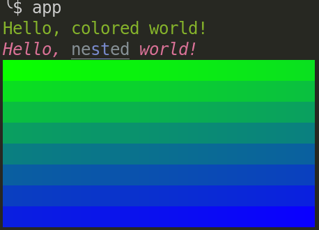

# clip

Composable, declarative command-line parsing for Scala.

Clip is a Scala library for creating command line interfaces, with minimal
boilerplate. It is highly configurable, but comes with sensible defaults out of
the box.

It aims to make the process of writing command line tools quick and fun.

Here is what it looks like:

```scala
//> using dep io.crashbox::clip::0.1.0

@clip.command(help = "Simple program that greets NAME for a total of COUNT times.")
def hello(
    @clip.arg("--count", help = "Number of greetings")
    count: Int = 3,
    @clip.arg("name",  help ="Your name")
    name: String
): Unit =
    for _ <- 0 until count do
        clip.echo(s"Hello ${name}!")

def main(args: Array[String]): Unit = clip.main(this, args)
```

When run:


```
$ ./app --count=3 John
Hello John!
Hello John!
Hello John!
```

Automatically generated help message (nicely laid out according to your
current terminal size):


```
$ ./app --help
Usage: hello [options] name

Simple program that greets NAME for a total of COUNT times.

Options:
  --color <mode>        Set color mode (auto, always, never)
  --completion <shell>  Generate shell completion script
  --count <integer>     Number of greetings
  --help                Show help message
Positional arguments:
  name                  Your name
```

In case of errors, it prints a summary of what is wrong:


```
$ ./app --count=oops
missing required argument: 'name'
invalid value for '--count': 'oops' is not an integral number
run with --help for more information
```


Clip is available for Scala on the JVM and Scala Native.

You can include it directly from maven central:

```scala
mvn"io.crashbox::clip::0.1.1"
```

It relies on `os-lib`. JDK 21 or greater is required. Certain features only work
on Linux and macOS, x86_64 and arm64.

## Feature tour

- [Annotation-based commands](#annotation-based-commands)
- [Parameter annotations](#parameter-annotations)
  - [Repeated parameters](#repeated-parameters)
  - [Parameter types](#parameter-types)
  - [Eager parameters](#eager-parameters)
- [Subcommands `app server`, `app fetch`, etc](#subcommands-app-server-app-fetch-etc)
  - [Sharing parameters and values](#sharing-parameters-and-values)
  - [Nested subcommands](#nested-subcommands)
- [Exception handling and error codes](#exception-handling-and-error-codes)
- [Automatically generated bash completion, with dynamic completions](#automatically-generated-bash-completion-with-dynamic-completions)
- [Utilities](#utilities)
  - [Output formatting](#output-formatting)
  - [ANSI color support](#ansi-color-support)
  - [Reading input](#reading-input)
  - [Launching applications](#launching-applications)
  - [Progress bars](#progress-bars)
  - [User directories](#user-directories)
- [Custom API traits](#custom-api-traits)

> [!NOTE] the examples shown here assume that the example code can be run as
> `./app`. If you'd like to play along, you have two options:
> 1. clone the repo, and run `./mill examples.<name of example>` instead of `./app`
> 2. use scala-cli, `./scala <example file> --` instead of `./app`

### Annotation-based commands

At minimum, a clip application consists of a method annotated with
`@clip.command()`, and a main method that calls `clip.main`.

```scala
@clip.command()
def app(
  count: Int = 5,
  name1: String,
  name2: String,
  flag: Boolean = false,
): Unit =
  println(s"count: ${count}, flag: ${flag}, name1: ${name1}, name2: ${name2}")

def main(args: Array[String]): Unit = clip.main(this, args)
```

Command line parameters are automatically defined based on the method
parameters, following these rules:

- Parameters with default values become named parameters on the command line.
  These start with `-` or `--`, and can be specified in any order.

  For example, the parameter `count: Int = 5` becomes the named parameter
  `--count <integer>`, which defaults to `5` if not specified.

- Parameters without default values become positional parameters, which must
  be specified in the order they are defined.

  For example, the parameters `name1: String` and `name2: String` become the
  positional parameters `name1` and `name2`.

- Parameters of type `Boolean` become flags, which are named parameters that
  don't take any argument. Specifying the flag sets the parameter to `true`.

  For example, the parameter `flag: Boolean = false` becomes the flag
  `--flag`, which defaults to `false` if not specified, and becomes `true` if
  specified.

Here is what this looks like in practice:


```
$ ./app Alice --count 3 Bob --flag
count: 3, flag: true, name1: Alice, name2: Bob
```


```
$ ./app Alice Bob
count: 5, flag: false, name1: Alice, name2: Bob
```

You can also set named parameters with `=`

```
$ ./app Alice --count=2 Bob
count: 2, flag: false, name1: Alice, name2: Bob
```

Clip automatically show errors for missing required arguments, too many
arguments, and invalid argument.


```
$ ./app Alice --flag
missing required argument: 'name2'
run with --help for more information
```


```
$ ./app Alice Bob Charlie
unknown argument: 'Charlie'
run with --help for more information
```


```
$ ./app --count=oops Alice Bob
invalid value for '--count': 'oops' is not an integral number
run with --help for more information
```

In case of argument errors, clip exits with exit code 2.


### Parameter annotations

Instead of relying on the default parameter-to-CLI mapping, you can
customize the command line interface using annotations.


```scala
@clip.command(
  name = "foo",
  help = "A simple clip application"
)
def app(
  @clip.arg(name = "--count", aliases = Seq("-c"), help = "Number of times to repeat")
  count: Int = 5,
  @clip.arg(name = "name1", help = "First name to greet")
  name1: String,
  @clip.arg(name = "--name2", help = "Second name to greet. Notice the use of -- here, making it a named parameter.")
  name2: String
): Unit =
  println(s"count: ${count}, name1: ${name1}, name2: ${name2}")

def main(args: Array[String]): Unit = clip.main(this, args)
```


```
$ ./app Alice -c 3 --name2 Bob
count: 3, name1: Alice, name2: Bob
```


```
$ ./app Alice
missing required argument: '--name2'
run with --help for more information
```


```
$ ./app --help
Usage: foo [options] name1

A simple clip application

Options:
  --color <mode>         Set color mode (auto, always, never)
  --completion <shell>   Generate shell completion script
  -c, --count <integer>  Number of times to repeat
  --help                 Show help message
  --name2 <string>       Second name to greet. Notice the use of -- here, making
                          it a named parameter.
Positional arguments:
  name1                  First name to greet
```

Notice the that the help message reflects the custom names and descriptions.
It also includes some additional options which we have not defined ourselves,
such as `--color` and `--completion`. We'll get into these a bit later.


#### Repeated parameters

By default, parameters can only be specified once on the command line. If you
want parameters to be repeatable multiple times, you can use the `repeats`
option in the `@clip.arg` annotation.

Repeated parameters must be of type `Iterable[T]`.

```scala
@clip.command()
def app(
    @clip.arg("--name", repeats = true)
    names: Seq[String],
    @clip.arg("extra", repeats = true)
    extra: Seq[String]
): Unit =
  println(s"names: ${names.mkString(", ")}, extra: ${extra.mkString(", ")}")

def main(args: Array[String]): Unit = clip.main(this, args)
```


```
$ ./app --name=Alice Alpha Bravo --name=Bob --name=Charlie Charlie
names: Alice, Bob, Charlie, extra: Alpha, Bravo, Charlie
```

Arguments after a literal `--` are always treated as positional, even if they
start with a `-` or `--`.


```
$ ./app --name=Alice A B --name=Bob --name=Charlie Charlie --Delta
unknown argument: '--Delta'
run with --help for more information
```


```
$ ./app --name=Alice A B --name=Bob --name=Charlie Charlie -- --Delta
names: Alice, Bob, Charlie, extra: A, B, Charlie, --Delta
```


#### Parameter types

Clip supports reading many different types of parameters, including

- primitive types (Int, String, Boolean, Double, etc.)
- paths (os.Path, java.nio.file.Path, java.io.File)
- tuples of key=value pairs
- times and durations (java.time types, and scala.concurrent.duration types)


```scala
@clip.command()
def main(
  num: Int = 0,
  num2: Double = 0,
  path: os.Path = os.pwd, // relative paths on the command line will be resolved to absolute paths w.r.t. to pwd
  keyValue: (String, Int) = ("a" -> 2),
  @clip.arg(name = "--key-values", repeats = true) keyValues: Seq[(String, Int)] = Seq(),
  @clip.arg(name = "--key-values-map", repeats = true) keyValuesMap: Map[String, Int] = Map(),
  duration: scala.concurrent.duration.Duration
) =
  println(s"num=$num")
  println(s"num2=$num2")
  println(s"path=$path")
  println(s"keyValue=$keyValue")
  println(s"keyValues=$keyValues")
  println(s"keyValuesMap=$keyValuesMap")
  println(s"duration=$duration")

def main(args: Array[String]) = clip.main(this, args)
```


```
$ ./app  --num 42 --num2 3.14 --path /tmp --key-value a=1 --key-values b=2 --key-values c=3 --key-values-map d=4 --key-values-map e=5 5s
num=42
num2=3.14
path=/tmp
keyValue=(a,1)
keyValues=List((b,2), (c,3))
keyValuesMap=Map(d -> 4, e -> 5)
duration=5 seconds
```


But what if you have a custom type that you want to read as a command line
parameter?

Clip supports this via the concept of "readers". A reader is essentially a
function that takes a `String` and produces a value of the desired type, or
fails with an error message. In order to make your custom type usable as a
command line parameter, you need to provide an implicit reader for it.


```scala
// this is our custom type
case class LogLevel(number: Int)

// here we define the implicit reader for our custom type
given clip.Reader[LogLevel] with
  def read(s: String): clip.ReadResult[LogLevel] =
    s.toLowerCase match
      case "debug" => clip.ReadResult.Success(LogLevel(1))
      case "info"  => clip.ReadResult.Success(LogLevel(2))
      case "warn"  => clip.ReadResult.Success(LogLevel(3))
      case "error" => clip.ReadResult.Success(LogLevel(4))
      case other   => clip.ReadResult.Error(
        s"invalid log level: '$other'. Valid levels are: debug, info, warn, error"
      )

  def typeName: String = "loglevel" // used in help messages

@clip.command()
def app(level: LogLevel): Unit =
  clip.echo(s"Log level set to: ${level.number}")

def main(args: Array[String]): Unit = clip.main(this, args)
```


```
$ ./app info
Log level set to: 2
```


```
$ ./app verbose
invalid value for 'level': invalid log level: 'verbose'. Valid levels are: debug, info, warn, error
run with --help for more information
```

If you find yourself needing to define readers for many custom types, in
various parts of your codebase, you may want to check out the section about
"[API traits](#custom-api-traits)".


#### Eager parameters

You might have noticed that all commands have a `--help` parameter available
which is not explicitly defined in the annotated method (there's no `help`
parameter in the method signature). Furthermore, when you pass in `--help`,
the command changes its behavior: rather than parsing arguments the normal
way, `--help` causes the command to print a message and exit.

This is an example of a so-called *eager parameter*. Eager parameters are
parameters that are parsed and handled before the main command logic is
executed, and they can alter the behavior of the command itself.

Other examples of eager parameters include the `--color` parameter, which as
a side-effect sets up colored output for the command, and the `--completion`
parameter, which generates shell completion scripts for the command.

You can define your own eager parameters and add them to your commands. Let's
look at an example, where we define a `--version` eager parameter that causes
the command to print its version and exit.


```scala
// an eager parameter essentially consists of two parts:
// 1. a parameter definition, which defines the name, help message, and other
//    properties of the parameter
// 2. an invocation function, which is always called before the main command
//    logic. This function can perform side-effects (such as printing to the
//    console) and return either a result (to stop further processing) or
//    indicate that processing should continue as normal.
val version = clip.dispatch.EagerParam(
  // the parameter definition
  param = clip.dispatch.Param(
    names = Seq("--version", "-v"),
    argName = None,
    help = "Show application version"
  ),
  // the invocation function: chain is the command chain leading to this
  // command, ctx is the command context, and args is the map of parsed
  // arguments
  invoke = (chain, ctx, args) =>
    val versionRequested = args("--version").nonEmpty
    if versionRequested then
      System.out.println("App version 1.0.0")
      // return a result to stop further processing
      clip.dispatch.EagerResult.Return(
        clip.dispatch.InvocationResult.Success(())
      )
    else
      // indicate that processing should continue as normal
      clip.dispatch.EagerResult.Continue
)

// we can now add this eager parameter to our command using the `eagers`
// parameter of the `@clip.command` annotation
@clip.command(
  eagers = Seq(version)
)
def app(): Unit =
  println("Hello from the app command!")

def main(args: Array[String]): Unit = clip.main(this, args)
```

Now, when we run our application with the `--version` flag, we see the
version information printed to the console, and the main command logic is not
executed.


```
$ ./app --version
App version 1.0.0
```

If we run the application without the `--version` flag,
the main command logic is executed as normal.


```
$ ./app
Hello from the app command!
```

Note that printing a version is such a common use-case for eager parameters
that clip already has a built-in eager parameter for this purpose: if you
define a `version` parameter in your `@clip.command` or `@clip.group`
annotation, for example `@clip.command(version="1.0.0")` you'll automatically
get a `--version` eager parameter that prints the version for you!


### Subcommands `app server`, `app fetch`, etc

Clip encourages the use of subcommands for structuring larger CLI
applications.


```scala
// We need to define a group to hold the subcommands. For now this is empty,
// but it could also contain shared parameters.
@clip.group()
def app(): Unit =
  ()

// Subcommands are defined as usual commands in the same file
@clip.command()
def update() =
  clip.echo(s"Updating items")

// Each subcommand can have its own parameter list
@clip.command()
def list(limit: Int = 10) =
  clip.echo(s"Listing items (limiting to ${limit})")

def main(args: Array[String]): Unit = clip.main(this, args)
```


```
$ ./app update
Updating items
```


```
$ ./app list
Listing items (limiting to 10)
```


```
$ ./app list --limit 5
Listing items (limiting to 5)
```

Parameter lists are separate, so if you try to pass --limit to update, it
will fail

```
$ ./app update --limit 5
unknown argument: '--limit'
run with --help for more information
```

If the command doesn't exist but is similar to others, they will be suggested
automatically. Similarity detection is based on the Jaro-Winkler distance algorithm

```
$ ./app l
unknown command: 'l'
run with --help for more information
similar commands:
  list
```


#### Sharing parameters and values

The previous example showed how to define subcommands, but they were all
isolated and had nothing in common. In practice, you often want to group
related commands together, possibly sharing some common parameters or state.

You can do this by:
1. defining parameters on the group itself
2. having the group function return an arbitrary object of your choice,
3. and then having the subcommands accept that object by marking it with a
   `@clip.context` annotation.

Example:

```scala
case class AppConfig(verbosity: Int)

@clip.group()
def app(verbosity: Int = 0): AppConfig =
  AppConfig(verbosity)

@clip.command()
def update(
    @clip.context config: AppConfig
) =
  if config.verbosity > 0 then
    clip.echo(s"[verbose] Updating items with verbosity ${config.verbosity}")
  else
    clip.echo(s"Updating items")

@clip.command()
def list(
  @clip.context config: AppConfig,
  limit: Int = 10
) =
  if config.verbosity > 0 then
    clip.echo(s"[verbose] Listing items (limiting to ${limit}) with verbosity ${config.verbosity}")
  else
    clip.echo(s"Listing items (limiting to ${limit})")

def main(args: Array[String]): Unit = clip.main(this, args)
```


#### Nested subcommands


We saw previously how to define subcommands in the same file as the
application's main. But what if you want to organize your commands in multiple
files, or have multiple levels of nesting?

In this case you need to define your subcommands in separate objects or
packages, and then refer to them from the group definitions.

```scala
package main:
  case class AppConfig(verbosity: Int)

  @clip.group(
    help = "A CLI application demonstrating nested subcommands",
    subcommands = sub2.cmds ++ Seq(sub3.cmd) // notice how we refer to commands defined in another package, these will be used in addition to any commands defined here
  )
  def app(verbosity: Int = 10) = AppConfig(verbosity)

  @clip.command()
  def sub1() =
    clip.echo(s"Subcommand 1 executed")

  def main(args: Array[String]): Unit = clip.main(this, args)

package sub2:

  @clip.command()
  def sub2() =
    clip.echo(s"Subcommand 2 executed")

  @clip.command()
  def sub3() =
    clip.echo(s"Subcommand 3 executed")

  // helper to get all commands defined in this package as subcommands
  val cmds = clip.subcommandsFor(this)

// this contains nested subcommands
package sub3:
  case class NestedConfig(app: main.AppConfig)

  @clip.group()
  def sub3(@clip.context config: main.AppConfig) =
    NestedConfig(config)

  @clip.command()
  def nested1(@clip.context config: NestedConfig) =
    clip.echo(s"Nested subcommand 1 executed with verbosity ${config.app.verbosity}")

  @clip.command()
  def nested2() =
    clip.echo(s"Nested subcommand 2 executed")

  // helper to make a new command with a group in this package
  val cmd = clip.commandFor(this)
```


### Exception handling and error codes

If you want to return early from a command, you can call `clip.abort()`. This
throws a `clip.AbortException`, which is caught by `clip.main` and causes it
to exit the program.

You can specify an exit code and a message to be printed.


```scala
@clip.command()
def app(x: Int) =
  if x % 2 != 0 then
    clip.abort(100, "x must be even")

  clip.echo(s"x is $x")

def main(args: Array[String]): Unit = clip.main(this, args)
```


```
$ ./app 1
x must be even
Aborted
```

(exit code 100)


### Automatically generated bash completion, with dynamic completions

TODO

### Utilities

In addition to command line *parsing*, clip has many features built-in which
help you build *complete* terminal apps.

#### Output formatting


```scala
@clip.command()
def app() =

  // `clip.echo` is similar to println, but is aware of whether the output
  // is being redirected to a file or a pipe, and strips ANSI escape codes
  // (like colors) in that case
  clip.echo("Hello, World!")

  // this line has red text when printed to a terminal, and normal text
  // when redirected to a file or pipe
  clip.echo("This is a line with \u001b[31mred\u001b[0m text.")

  // often times in CLI applications you want to print tabular data
  // `clip.tabulate` helps with that by aligning the columns nicely
  clip.tabulate(
    Seq("Name", "Age", "City"),
    Seq(
      Seq("Alice", "30", "New York"),
      Seq("Bob", "25", "Los Angeles"),
      Seq("Charlie", "35", "Chicago"),
    )
  )

def main(args: Array[String]): Unit = clip.main(this, args)
```

Example usage:

```
$ ./app
Hello, World!
This is a line with red text.
Name      Age   City
Alice     30    New York
Bob       25    Los Angeles
Charlie   35    Chicago
```

Clip's output utilities handle ANSI escape codes in a sane way. They are
stripped or kept based on the following rules:

1. check if the command line parameter `--color` is provided:
   - if `--color=always`, ANSI codes are always kept
   - if `--color=never`, ANSI codes are always stripped
   - if `--color=auto` or not provided, proceed to the next step

2. check the environment:
   - if FORCE_COLOR is set, ANSI codes are always kept
   - if NO_COLOR is set or TERM is dumb, ANSI codes are always stripped
   - if neither is set, proceed to the next step

3. check the output destination:
   - if output is a terminal, ANSI codes are kept
   - if output is a file or a pipe, ANSI codes are stripped

Essentially, this means that unless you explicitly forbid or force colors via
the command line or environment variables, colors will be kept when printing
to a terminal, and stripped when redirecting output to a file or a pipe.


```
$ ./app --color=always
Hello, World!
This is a line with red text.
Name      Age   City
Alice     30    New York
Bob       25    Los Angeles
Charlie   35    Chicago
```


#### ANSI color support


```scala
@clip.command()
def app() =

  // Use `clip.style` to create colored and styled text
  println(clip.style(fg=clip.Green)("Hello, colored world!"))

  // You can nest styles for more complex formatting, where inner styles
  // override outer styles as needed. The API is similar to scalatags.
  clip.echo(
    clip.style(fg=clip.Red, italic=true, bold = true)(
        "Hello, ",
        clip.style(fg = clip.Rgb(0, 20, 30), italic = false, underline=true)(
          "ne",
          clip.style(fg=clip.Blue)("st"),
          "ed"
        ),
        " world!",
    ).render()
  )

  val parts = for i <- 0 until 256 yield clip.style(bg = clip.Rgb(10, 255-i, i))(" ").render()
  for line <- parts.grouped(32).map(_.mkString("")) do
    clip.echo(line)

def main(args: Array[String]): Unit = clip.main(this, args)
```



While convenient, `clip.style` may not be the most efficient if you have
deeply nested styles. If it becomes a performance bottleneck, consider
using a dedicated library such as
[fansi](https://github.com/com-lihaoyi/fansi).


#### Reading input

Clip has various utilities to read user input from the terminal.

Note: when building CLI applications, prefer using command line arguments for
input whenever possible. Reading from the terminal should be reserved for
cases where you only ever want your application to be used interactively.

```scala
@clip.command()
def app() =

  // You can use clip.prompt to read user input from the terminal. If the
  // session is non-interactive (e.g., input is redirected from a file or pipe),
  // clip.prompt will use the default, or throw an error if no default is
  // provided.
  val name: String = clip.prompt[String]("Enter your name", default = "Guest")

  // It can read various types, as long as there is a Reader available, just
  // like for command line parameters.
  // If the user enters invalid input, they will be prompted again.
  val age: Int = clip.prompt[Int]("Enter your age")

  // You can also hide input for sensitive data like passwords. Setting password = true
  // will disable echoing of input characters to the terminal.
  val password: String = clip.prompt[String]("Enter your password", password = true)

  // For yes/no questions, you can use clip.confirm, which returns a Boolean.
  // It accepts various forms of yes/no input (y/n, yes/no).
  val confirm: Boolean = clip.confirm("Do you want to proceed?")

  if confirm then
    clip.echo(s"Hello, $name! You are $age years old.")
    clip.echo(s"Your password is ${password}")
  else
    clip.echo("Operation cancelled.")
    clip.abort(2)

def main(args: Array[String]): Unit = clip.main(this, args)
```

```
$ ./app
Enter your name [default: Guest]: Alice
Enter your age: a
Invalid input: 'a' is not an integral number
Enter your age: 30
Enter your password: [input hidden]
Do you want to proceed? (y/n): y
Hello, Alice! You are 30 years old.
Your password is mysecretpassword
```


#### Launching applications

In case you need to open a URL or file from your application, you can use
`clip.launch`. It will open the URL or file using the user's preferred
application for that file type.

For example, to open a URL in the web browser:

```scala
clip.launch("https://www.example.com")
```

Or to open a file in the default text editor:

```scala
clip.launch("README.md")
```

As of now, `clip.launch` only works on Linux, on systems which support the
xdg-open command.


#### Progress bars

You can display a progress bar for long-running tasks using clip.progressbar.

Use `clip.progressbar` to set up basic progress bar parameters, then `.wrap`
it around a collection or a `geny.Readable` to track progress as you iterate
over the items.


```scala
@clip.command()
def app() =
  val items = 0 until 1000
  val progress = clip.progressbar("Processing").wrap(items)
  for item <- progress do
    // Simulate some work
    Thread.sleep(5)

def main(args: Array[String]): Unit = clip.main(this, args)
```


#### User directories


The `clip.userdirs` utility class provides a convenient way to access
user-specific directories for configuration, cache, data, state, and
runtime. It is designed for command line applications that run in a user
context, not a system context (e.g., a daemon).

It is a good idea to use this utility class to ensure that your application
respects the user's preferences for where to store files.

As of now it uses the XDG Base Directory Specification to determine the
appropriate directories, and it is currently only implemented for Linux.


A directory where the application can store its configuration files.

`~/.config/myapp` is the default location

```scala
clip.userdirs("myapp").config
```

A directory where the application can store cached files. These files can
be recreated or downloaded again if deleted.

`~/.cache/myapp` is the default location

```scala
clip.userdirs("myapp").cache
```

A collection of preference-ordered directories where the application can
find data files. Data files are typically static files that the application
needs to function, but don't contain the application's state (e.g., static
media files).

`~/.local/share/myapp` is the default location, followed by
`/usr/local/share/myapp` and `/usr/share/myapp`.

```scala
clip.userdirs("myapp").data
```

The data collection always has at least one element.

```scala
clip.userdirs("myapp").data.head
```

A directory where the application can store its state. This is typically
used for files that should persist between runs, such as database files.

`~/.local/state/myapp` is the default location

```scala
clip.userdirs("myapp").state
```

A directory where the application can store special files such as sockets
and named pipes. This directory is typically cleared on reboot.

`/run/$UID/myapp` is the default location

```scala
clip.userdirs("myapp").runtime
```


### Custom API traits

Earlier we saw how to create custom parameter readers for new types. But what
if you want to create a reader for a type that a) you don't control, and b)
you don't want to have `import givens` all over your code? Or what if you
want to change the way a built-in type is read? This is where API traits come
in.

You can think of API traits as a way to "globally" configure what readers are
to be used throughout your application, without having to import them
everywhere.

The way it works is the following:
1. you define a custom object that extends the configuration trait,
   `clip.derivation.Api`
2. you define the readers you want to use in that object
3. you use that object instead of `clip` in your argument annotations

Here is an example of how to use API traits to change the path reader to only
accept absolute paths (starting with a /).


```scala
// this is the object that implements the API trait, you'd typically define this
// once for your whole application
object mycli extends clip.derivation.Api:

  // here we override the path reader to only accept absolute paths (the default
  // reader accepts both absolute and relative paths, and converts them to
  // absolute paths relative to the current working directory)
  given Reader[os.Path] with
    def read(s: String) =
      os.FilePath(s) match
        case p: os.Path => clip.ReadResult.Success(p)
        case _          => clip.ReadResult.Error(s"$s is not an absolute path")
    def typeName = "absolute path"

@clip.command()
def app(
  @mycli.arg("path") // instead of @clip.arg, we use @mycli.arg to use our custom reader
  path: os.Path
) =
  clip.echo(s"The provided path is: $path")

def main(args: Array[String]): Unit = clip.main(this, args)
```


```
$ ./app foo/bar
invalid value for 'path': foo/bar is not an absolute path
run with --help for more information
```


```
$ ./app /foo/bar
The provided path is: /foo/bar
```


## Acknowledgments

Clip is inspired by a similarly-named Python project,
[Click](https://click.palletsprojects.com/en/stable/). It borrows many of its
concepts, particularly the CLI utilities.

## See also

Clip is by no means the only library you can use to build command line
interfaces in Scala.

Here are a few other options to check out:

- [scopt](https://github.com/scopt/scopt) A flexible command-line argument
  parser.
- [mainargs](https://github.com/com-lihaoyi/mainargs) Also a declarative
  approach to building CLIs, based on annotations. Handles subcommand grouping
  differently than clip, and I don't think it is designed for nestable
  subcommands which can share data.
- [scala-argparse](github.com/jodersky/scala-argparse) Library for building
  command-line parsers, from the same author of this project. It can be thought
  of as the predecessor to this project, and shares the command-line syntax
  parser code. If you've used it, you'll notice the command-line grammar looks
  very similar.

## Changes

- 0.1.0 2025-11-17

  Initial release